# Usage Documentation
#### VIEW OUR VIDEO WALKTHROUGH HERE: https://www.youtube.com/watch?v=mOqSsv-v62I&feature=youtu.be
 
 
 

## Don't forget !
1. A Homepage Template is required.**/sitecore/templates/Feature/PageContent/Homepage**
2. A Hackathons Overview Page is required. **/sitecore/templates/Feature/PageContent/Hackathons Overview Page**

## Example Starter Content !
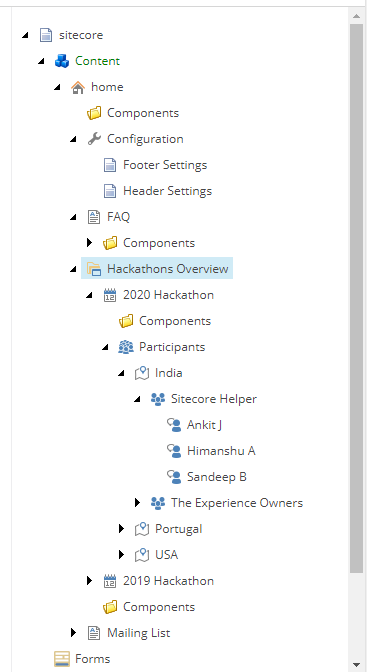
 
 
 
 

## Header Component
**This component appears on all Base Page Templates and inheritance**
**/sitecore/templates/Feature/Global/Header**
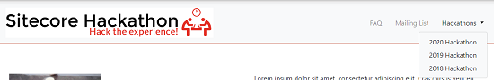.
1. Header will automatically pull into the navigation any Base Page and Hackathon Year Page Templates underneath the Homepage Template
2. Header Image and Header Mobile Image are configurable in the Header Settings Item Under Configuration
2. Footer Rich Text is configurable in the Footer Settings Item Under Configuration
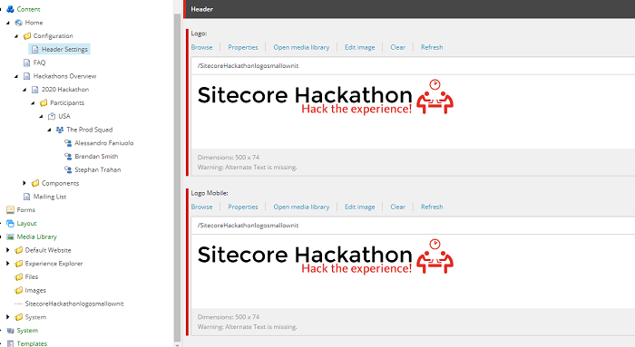
 
 
 
 

## Base Page Template
**/sitecore/templates/Feature/PageContent/Base Page**
1. The Base Page can be inserted into any position below Homepage
2. Base Page will auto fill its Page Title acccording to item name.
3. A /Components Folder should auto-populate in the tree.
4. Base Page has three placeholders (content header, content body, & content footer)
5. Each Placeholder can have a container inserted:
 

### Container
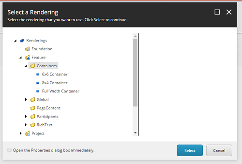
 
1. The Full-Width Container allows inserting components. There are two components:
 
 

### Rich Text Component
**/sitecore/layout/Renderings/Feature/RichText/Rich Text Component**
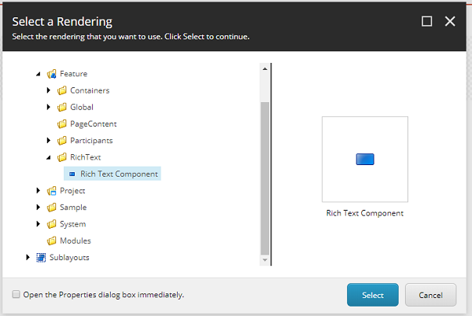 
1. RTE Components can be added into any position in any container. They support Rich Text Content Entry.
 
 

### Home Page Banner Countdown
**/sitecore/templates/Feature/Banners/Countdown Banner Component**
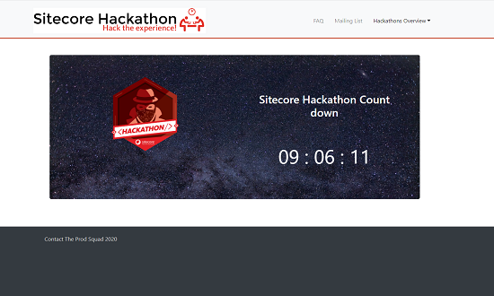 
1. This can be placed in the full Width Container
2. You need to set a background image on this component
3. End DateTime will set the time to countdown to.
4. checking the Show Countdown Banner checkbox and publishing will start the countdown.
 
 
 
 
 
 

## Hackathon Year Page Template
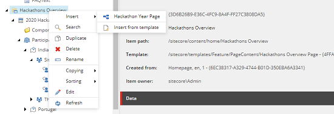
**/sitecore/templates/Feature/PageContent/Hackathon Year Page**
1. The Hackathon Year Page Template will start a Participants Folder Tree to enter Team Information as described below.
2. The Hackathon Year Page should only be inserted into the required Hackathons Overview Page **/sitecore/templates/Feature/PageContent/Hackathons Overview Page**
3. This Template supports Containers with Rich Text or Containers with the Team Listing Component
 
 

## Participants Folder and Templates
**/sitecore/templates/Feature/Participants/**
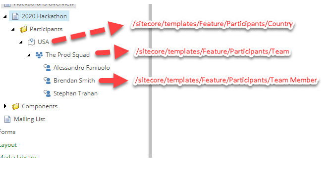
1. The Participants Tree organizes participants and hackathon teams by Country.
2. First, you'll need to add a Country under Participants **/sitecore/templates/Feature/Participants/Country **
3. Second, you'll need to add a Team by Team Name **/sitecore/templates/Feature/Participants/Team**
4. Third, you'll add all the participating team Members for the corresponing team **/sitecore/templates/Feature/Participants/Team Member**
5. The Participants Tree should always be a child of a Hackathon Year Page Template in order to get the Team Listing Component to source properly.
 
 

### Team Listing Component
**/sitecore/layout/Renderings/Feature/Participants/Team Listing**
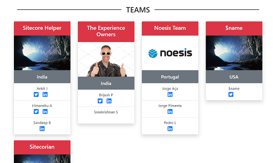
1. The Team Listing Component Component will display Team Cards on the Hackathon Year Page **/sitecore/templates/Feature/PageContent/Hackathon Year Page**
2. This component can be added in a Full-Width Container
3. As long as the Participant Tree is populated a published below the Year Page, the Listing will populate.
 
 
 
 

## Creating the Winners Base Page
1. The Base Page Template can be created underneath the Hackathon Year Page Template to create a 'Winners' Page
2. This page does not show in navigation but can be linked to from anywhere on the tree via Rich Text.
3. Winner Detail Templates are created underneath these Winner Base Pages in order to create a Winner Listing Component.
 
 

### Winner Detail Template
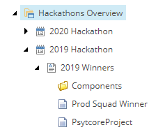
1. The Winner Template is used to fill in data to create a Winners Card on the Winners Listing Page **/sitecore/templates/Feature/Winners/Winner**
2. Multiple Winners can be add to the tree and will populate using the Winners Listing Component.
 
 

### Winners Listing Component
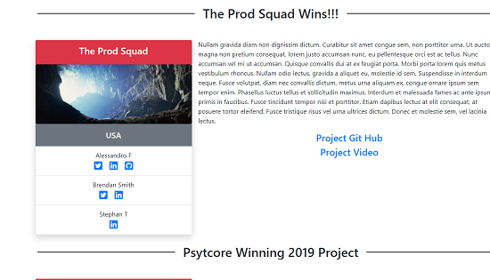
**/sitecore/layout/Renderings/Feature/Winners/Winners Listing**
1. The Winners Listing should only be added on a 'Winners Base Page' with 'Winner Detail Templates' in order to source properly.
2. This should be a child of the Year Page in order to source the Participant data correctly.
 
 

